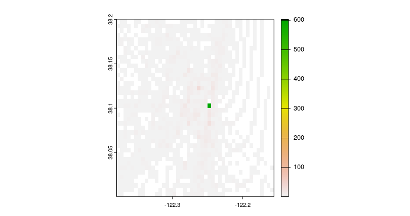
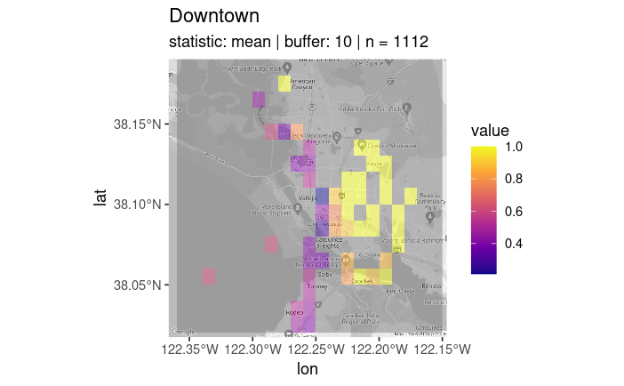
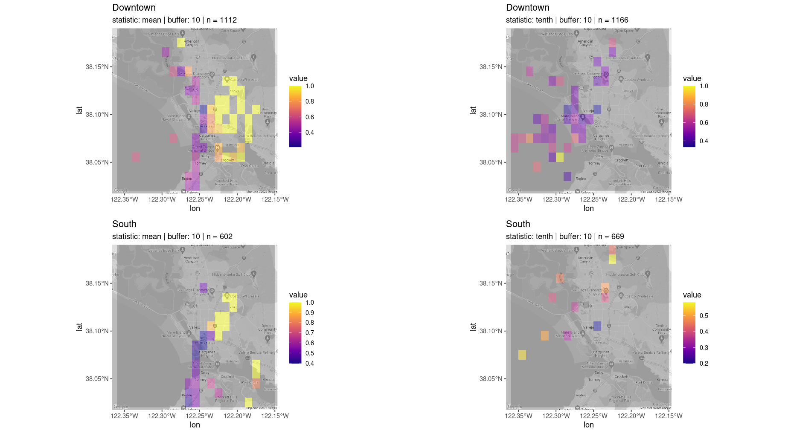

Zixuan Liang\
[zrliang\@ucdavis.edu](mailto:zrliang@ucdavis.edu){.email}\
2/7/2024

The *testtraj* package was developed to identify sources of air pollution at a hyper local scale. While similar trajectory visualization tools exist, these tools can only be used to view trajectories at county level scales or larger. This package utilizes interpolation methods to estimate trajectory patterns at a scale that allows for the anlaysis of patterns within a single city. This vignette demonstrates how to use *testtraj* to create a conditional frequency plot of particulate matter in Vallejo.

Before you begin, make sure that the package folder contains the **hyts_std** executable file. Check that the file has permissions to run as an executable. On Linux, find the **hyts_std** file and copy it into the package folder. Click on the Permissions tab and check the box to "Allow executing file as program."

```{r, include = FALSE}
knitr::opts_chunk$set(
  collapse = TRUE,
  comment = "#>"
)
```

```{r setup}
# library(testtraj) # Used to generate the interpolated trajectories. Also automatically loads in the tidyverse package for its data analysis tools. 
# library(terra) # provides necessary GIS tools
# library(ggmap) # used to overlay trajectories onto maps
```

First, we will use the *get_traj()* function to generate interpolated trajectories and store the points in *test*, a dataframe. This function will automatically download all necessary meteorological data files from the NOAA Air Resources Laboratory Archives if they are not found on your device. For the list of dates with data available for download, visit the [NOAA Air Resources Laboratory Data Archives](<https://www.ready.noaa.gov/archives.php>). By default, *get_traj* will download the reanalysis data files, but this can be adjusted using the "Met" parameter.

Add a date in 'YYYY-MM-DD' character format for the trajDate parameter.

Next, configure the directories:

-   Set the OutDir, or output directory, to a folder where the trajectory files will be generated.

-   Set the MetDir, or meterological data directory, to a folder where meteorological data files will be stored. It is recommended that whenever using the testtraj package, this directory is set to a new folder outside of the testtraj package to reduce duplicate file downloads.

-   Set the ExecDir, or executive directory, to the folder that has the **hyts_std** file. In *get_traj()*, the default for the ExecDir is your working directory. However, this executable file is essential for downloading the data correctly, so it is recommended to set this path manually.\
    Change file paths based on operating system.

```{r}
# test <- get_traj(trajDate = '2019-06-01',
#                  OutDir = '/home/donatello/Documents',
#                  MetDir = '/home/donatello/Met',
#                  ExecDir = '/home/donatello/Rprojects/testtraj/')
```

Add a troubleshooting section?

More often, you will generate trajectories for multiple dates at a time. To do so, first create an object, dates, to contain your desired range of dates. Make sure the dates are in character format.

```{r}
# dates <- seq(as.Date('2019-02-01'),
#              as.Date('2019-02-25'),
#              "days") %>%
#   as.character()
```

Using the map_dfr function from the purrr package, run the get_traj() function over each date you listed. Save the output dataframe as an RDS file for future use.

```{r}
# traj <- map_dfr(dates, ~get_traj(.,
#                                  OutDir ='home/donatello/Documents',
#                                  MetDir = '/home/donatello/Met',
#                                  ExecDir = '/home/donatello/Rprojects/testtraj'))
# saveRDS(traj, '/home/donatello/Rprojects/traj_example')
```

The dataframe traj now contains the interpolated trajectory points. The next step is to identify the boundaries of your area of interest, and filter down the points to within that boundary. Here, I use tools from *tidyverse* to set the boundaries. You can use Google Maps to obtain the coordinates for this step. 

```{r}
# # read in trajectory data
# traj <- readRDS('/home/donatello/Rprojects/data/traj_example') %>%
#   # filter for points within Vallejo boundaries
#   filter(lat >= 38.0 &
#          lat <= 38.2 &
#          lon >= -122.38 &
#          lon <= -122.15)
```

Now that the points have been filtered down to the specified area, use the *terra* package to get the extent of the area.

```{r}
# # get extent
# trajExt <- cbind(traj$lon, traj$lat) %>%
#   ext()
```

Using the extent, create a blank raster grid using *rast()* from the *terra* package. Depending on the scale of the trajectories, adjust the resolution. Increasing the resolution parameter will increase the distance between the points in each gridcell, causing fewer gridcells in the grid. 

```{r}
# # create blank grid from extent
# trajgrid <- rast(trajExt,
#                resolution = 0.005,
#                crs = '+proj=longlat +datum=WGS84')
```

Now, use the *rasterize()* function from the terra package to create a frequency plot of the trajectory points. This function will count the number of times that each trajectory passes over each grid cell.  
```{r}
# # create coordiates matrix for rasterize function
# coords <- cbind(traj$lon, traj$lat)
# # generate frequency plot
# outputs <- rasterize(coords, trajgrid, fun = 'count')
# plot(outputs)
```


Next, we will be making a conditional frequency map, which displays the trajectory points where there were significant measurements of PM. Currently, this feature of *testtraj* is specific to Vallejo.

You will need a basemap and a dataset.  At minimum, the dataset needs to include air quality measurements and the associated dates, times, coordinates, and region of Vallejo for each measurement. The PM data set used below contains particulate matter data downloaded from PurpleAir. The basemap used below is downloaded using the *ggmap* package. Learn more about downloading *ggmap* basemaps [here](https://rdrr.io/cran/ggmap/man/get_map.html).   

```{r}
# # # Vallejo basemap downloaded from the ggmap package
# vallejo <- readRDS('/home/donatello/Rprojects/data/Vallejo_basemap.RDS')
# 
# # PM Data
# siteDF <- readRDS('/home/donatello/Rprojects/data/pmData')
```

Now, use the *make_map()* function to generate the conditional frequency map.
```{r}
# make_map(region = 'Downtown',
#          statistic = 'mean',
#          basemap = vallejo,
#          buffer = 10)
```


There is also the option to make multiple maps with varying statistics and regions using the *make_more_maps* function. 
```{r}
# # create vectors of the regions and statistics you want
# regs <- c('Downtown', 'South')
# stats <- c('mean', 'tenth')
# # use the make_more_maps() function
# maps <- make_more_maps(regs, stats, vallejo)
# # use cowplot to create a grid of plots
# cowplot::plot_grid(plotlist = mget(maps),
#                    nrow = 2,
#                    ncol = 2)
```
